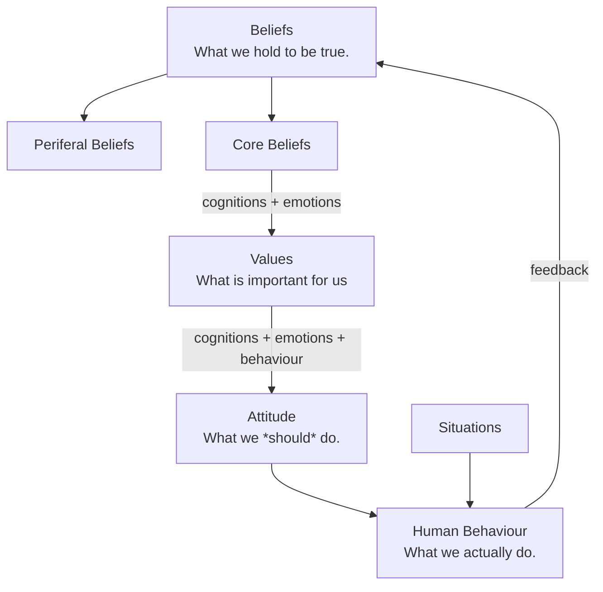

[[2020-12-19| 19th December 2020, Saturday]] | 20:32

# Relationships between common terms in ethics and philosophy
tags: #ethics #GS4 #diagram 

#### Same diagram in picture:
#insertDiagram 
![[../../../Sources/_media/Pasted image 20201222005747.png]]

**Related**
- [[Beliefs]] = Cognition
	- [[Peripheral Beliefs]]
	- [[Core Beliefs]]
- [[Values]]
- [[Attidues]]